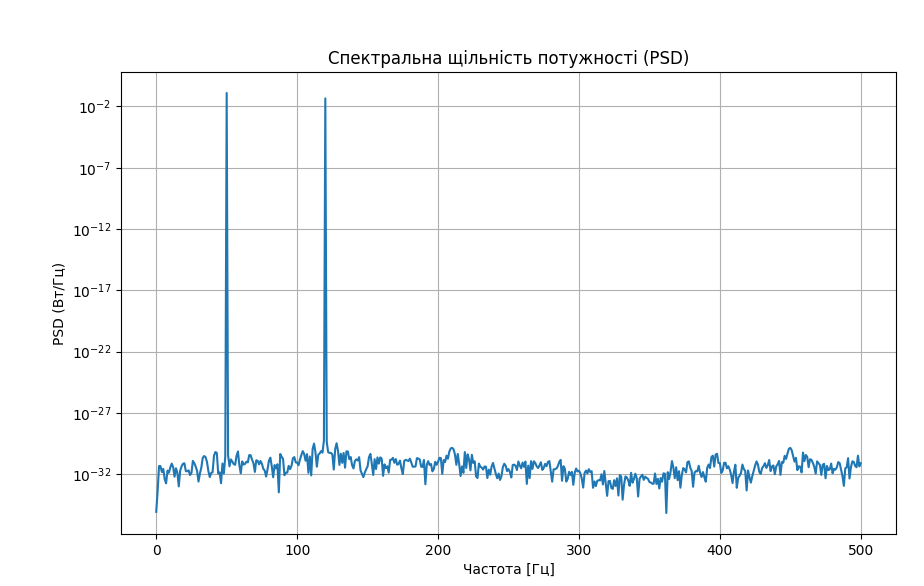

### Аналіз графіка

#### 1. Піки на графіку
- Побудований графік показує два виразних піки: один на частоті **50 Гц**, а інший — на **120 Гц**. Це відповідає частотам двох синусоїдальних компонентів у вихідному сигналі. Поява цих піків на графіку вказує на те, що основна потужність сигналу сконцентрована саме на цих частотах.
- Висота кожного піка пропорційна потужності сигналу на цій частоті.

#### 2. Одиниці вимірювання
- По вертикальній осі графіка ми бачимо значення PSD у Вт/Гц. Це означає, що значення на осі показують потужність сигналу, яка припадає на одиницю частотного інтервалу.
- Використання логарифмічної шкали на вертикальній осі (plt.semilogy()) допомагає краще візуалізувати різні рівні потужності, особливо якщо різниця в них значна.

#### 3. Шум та інші частотні компоненти
- Якщо на графіку є невеликі підвищення потужності поза основними піками (наприклад, у діапазоні низьких чи високих частот), це може вказувати на наявність шуму або незначних гармонік.
- У нашому випадку ми не додавали шум у сигнал, тому графік має бути чистим без значних підйомів у інших місцях спектра.

#### 4. Ширина піків
- Ідеальні синусоїди створюють дуже вузькі піки на графіку. Якщо пік розмитий або має значну ширину, це може свідчити про обмежену тривалість відліків або про те, що сигнал є не повністю стаціонарним.
- Для реальних сигналів ширина піків може давати інформацію про затухання чи швидкоплинні коливання.

#### 5. Застосування
- **Діагностика**: Наприклад, у системах вібраційного моніторингу можна використовувати PSD для виявлення домінуючих частот коливань, що дозволяє ідентифікувати джерела проблем.
- **Обробка сигналів**: Аналіз PSD дозволяє визначити, які частоти потрібно фільтрувати чи підсилювати для поліпшення якості обробки.
- **Телекомунікації**: PSD використовується для оцінки ефективності передачі сигналу, де важливо знати, в яких діапазонах передається найбільше енергії.

### Додатковий аналіз
Якщо сигнал реальний, додатково слід враховувати такі аспекти:

- **Вплив віконних функцій**: При обчисленні PSD вибір віконної функції (наприклад, Хеннінга чи Хеммінга) може зменшити ефект витоків спектра і зробити пік більш точним.
- **Середнє згладжування**: Для більш гладкого вигляду PSD можна використовувати усереднення кількох періодограм.

### Загальний висновок
Графік PSD дає зрозуміти, що сигнал містить основні компоненти на 50 Гц та 120 Гц. Таке розподілення потужності можна використовувати для подальшого аналізу сигналу, наприклад, для проектування фільтрів або для оцінки характеристик систем, які працюють з цим сигналом.

PSD є важливим інструментом, що дозволяє ідентифікувати частотний склад сигналу і зрозуміти, яка частота несе найбільше інформації або потужності.