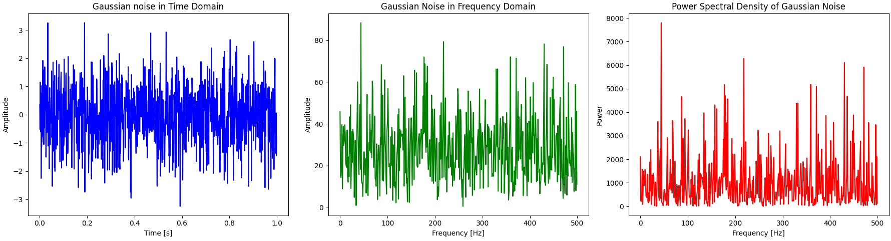

### Аналіз графіків

#### 1. Часова область (графік 1)
- Гаусівський шум в часовій області представлений випадковим сигналом з амплітудами, що коливаються навколо середнього значення (нуль). Шум має хаотичну структуру без повторюваних шаблонів, що відповідає його випадковій природі.
- Сигнал показує рівномірний розподіл шуму протягом усього часового інтервалу.

#### 2. Частотна область (графік 2)
- Графік частотної області показує амплітудний спектр шуму. Видно, що амплітуди розподілені доволі рівномірно по всьому спектру, підтверджуючи, що шум є "білим" (спектральна щільність є відносно постійною).
- Невеликі коливання амплітуд у частотній області є характерними для випадкових процесів.

#### 3. Спектральна потужність (графік 3)
- Графік потужності спектра показує рівномірний розподіл енергії по частотах, що підтверджує властивість білого шуму мати постійну спектральну потужність.
- Потужність має певний рівень варіацій, але в цілому сигнал має стабільну щільність енергії по всьому діапазону частот.

### Висновки
Гаусівський шум в часовій області виглядає як хаотичний сигнал, але в частотній області видно, що його енергетичний спектр рівномірно розподілений по всіх частотах. Спектральна потужність підтверджує властивість білого шуму, яка свідчить про його рівномірну енергію. Це пояснює, чому білий шум зазвичай моделюється для тестування стійкості систем зв'язку до різних перешкод.
