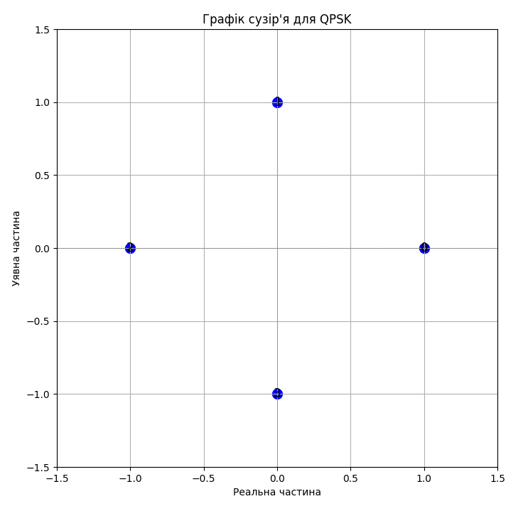

### Як перевірити якість сигналу PSK
Для цього застосовують різні методи, серед яких найпоширеніші включають аналіз графіків сузір'я, вимірювання коефіцієнта відношення сигналу до шуму (SNR), а також розрахунок ймовірності бітової помилки (BER).

#### 1. Графік сузір'я
- Аналіз точок: Графік сузір'я допомагає оцінити якість сигналу шляхом візуального аналізу розташування точок. Ідеально чіткі точки означають високу якість сигналу, тоді як розмиття, зміщення або розсіювання точок указують на вплив шуму чи перешкод.
- Деформації та зміщення: Зміщення точок може свідчити про фазову чи амплітудну нестабільність, міжсимвольні інтерференції або інші проблеми.

#### 2. Коефіцієнт відношення сигналу до шуму (SNR):
- **SNR** визначає, наскільки сильний сигнал відносно рівня шуму. Вимірюється в децибелах (дБ).
- **Вплив SNR**: Чим вище значення SNR, тим менше шуму у відношенні до сигналу, що означає кращу якість передачі. Для PSK важливо забезпечити достатньо високий SNR, щоб уникнути помилок у прийманні даних.

#### 3. Ймовірність бітової помилки (BER):
- **BER** – це ймовірність того, що біти, прийняті приймачем, містять помилки.
- **Розрахунок BER**: BER можна розрахувати шляхом порівняння переданих та прийнятих бітів і визначення частки помилкових бітів.
- **Теоретичний та емпіричний аналіз**: BER також можна оцінити теоретично на основі значення SNR для PSK. Для емпіричного аналізу проводяться експерименти з реальними даними.

#### Як проводиться перевірка на практиці:
- **Осцилографи та аналізатори спектру**: Використовуються для візуалізації сигналів та аналізу їх частотних характеристик.
- **Програмні інструменти**: Спеціальні симуляційні та діагностичні програми дозволяють моделювати передачу сигналів, проводити аналіз сузір'я, розраховувати SNR та BER.

### Підсумок
Щоб перевірити якість сигналу PSK, важливо:

- Візуалізувати сигнал за допомогою графіка сузір'я.
- Розрахувати SNR для оцінки співвідношення сигналу до шуму.
- Визначити BER для оцінки надійності передачі даних.
- Провести аналіз фазового та амплітудного шуму, використовуючи відповідне обладнання або програмні засоби.

